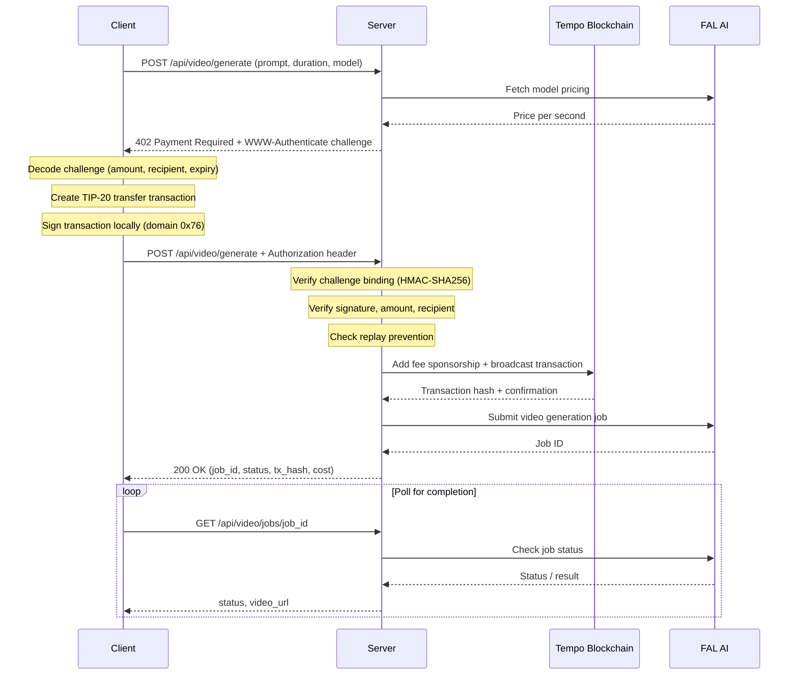

# video-gen-mpp

AI video generation API that requires cryptographic micropayments on the [Tempo](https://tempo.xyz) blockchain before processing requests. Built on the [Machine Payments Protocol (MPP)](https://paymentauth.org), an HTTP-native payment standard that extends the `402 Payment Required` status code.

## What is MPP?

The Machine Payments Protocol defines how machines negotiate and settle payments over HTTP. It uses standard HTTP semantics: the server responds with `402 Payment Required` and a `WWW-Authenticate: Payment` challenge, and the client retries with an `Authorization: Payment` credential containing a signed blockchain transaction. This lets any HTTP client pay for API access without accounts, API keys, or billing agreements.

## What is Tempo?

[Tempo](https://tempo.xyz) is a blockchain optimized for real-time payments. It supports fee-sponsored transactions (the server can pay gas on behalf of the client) and TIP-20 tokens like **pathUSD**, a USD-denominated stablecoin used as the payment currency in this project.

## How it works

This API wraps [FAL AI](https://fal.ai) video generation models behind an MPP payment gate. When a client requests video generation, the server quotes a price based on the model and duration, issues a payment challenge, and only dispatches the job to FAL AI after verifying the client's signed pathUSD transfer on Tempo.



## Supported models

| Model | Description |
|-------|-------------|
| `fal-ai/veo3.1/fast` | Fastest generation (default) |
| `fal-ai/veo3.1` | Standard quality |
| `fal-ai/kling/video/v2.5/pro` | Kling Pro model |
| `fal-ai/wan/v2.2-a14b/image-to-video` | Image-to-video |

Pricing is fetched dynamically from FAL AI with a 20% server markup.

## Prerequisites

- Python 3.11+
- A [FAL AI](https://fal.ai) API key
- Two Tempo testnet wallets (one for the server, one for the client) funded with pathUSD

If you haven't set up Tempo wallets yet, see [docs/tempo-wallet-setup.md](docs/tempo-wallet-setup.md) for a step-by-step guide.

## Setup

```bash
# Clone and install dependencies
git clone <repo-url>
cd video-gen-mpp
pip install -r requirements.txt

# Copy and configure environment
cp .env.example .env
# Edit .env with your server keys and FAL API key (see comments in file)
```

See [.env.example](.env.example) for a description of each variable.

## Running the server

```bash
uvicorn main:app --host 0.0.0.0 --port 8000
```

## Usage

### Option 1: Python client (`client-pay.py`)

The included client script handles the full payment flow automatically: request, challenge, sign, pay, poll.

**Prerequisites:**
- Server running locally (or specify `--url`)
- Client private key set in `.env.client` or passed via `--private-key`

```bash
# Using .env.client (recommended)
python client-pay.py --prompt "A cat playing piano"

# With options
python client-pay.py \
  --prompt "A robot walking through a forest" \
  --duration 10 \
  --model "fal-ai/veo3.1" \
  --verbose

# Pass key directly (not recommended for production)
python client-pay.py \
  --prompt "Ocean waves" \
  --private-key "0xabc..."
```

**All flags:**

| Flag | Default | Description |
|------|---------|-------------|
| `--prompt` | (required) | Video generation prompt |
| `--duration` | `5` | Video duration in seconds (1-30) |
| `--url` | `http://localhost:8000` | Server URL |
| `--model` | `fal-ai/veo3.1/fast` | FAL AI model to use |
| `--private-key` | from `.env.client` | Tempo wallet private key |
| `-v` / `--verbose` | off | Show detailed transaction info |

### Option 2: curl (manual two-step flow)

The MPP flow is two HTTP requests. This is useful for debugging or integrating from other languages.

**Prerequisites:**
- Server running
- `jq` installed (`brew install jq` / `apt install jq`)

**Step 1: Get the payment challenge**

```bash
curl -s -D - -X POST http://localhost:8000/api/video/generate \
  -H "Content-Type: application/json" \
  -d '{
    "prompt": "A beautiful sunset over mountains",
    "duration_seconds": 5,
    "model": "fal-ai/veo3.1/fast"
  }'
```

The server responds with `402 Payment Required`. The response body contains the amount and session ID. The `WWW-Authenticate` header contains the full challenge with HMAC binding.

**Step 2: Pay and retry**

You need to construct a signed TIP-20 transfer and encode it as an MPP credential. This is non-trivial from bash alone since it requires secp256k1 signing and RLP encoding. Use `client-pay.py` or implement the signing logic in your language of choice. The credential goes in the `Authorization: Payment <base64url>` header.

**Step 3: Poll for results**

```bash
# Replace JOB_ID with the job_id from the payment response
curl -s http://localhost:8000/api/video/jobs/JOB_ID | jq
```

## API reference

| Method | Path | Description |
|--------|------|-------------|
| `GET` | `/` | Health check |
| `POST` | `/api/video/generate` | Request video generation (returns 402 challenge or 200 with payment) |
| `GET` | `/api/video/jobs/{job_id}` | Poll job status and retrieve video URL |

## Project structure

```
video-gen-mpp/
├── main.py              # Starlette app, API routes, payment + FAL orchestration
├── config.py            # App configuration (FAL key, models, pricing markup)
├── client-pay.py        # Reference client with full MPP payment flow
├── mpp/                 # Machine Payments Protocol implementation
│   ├── challenge.py     # HMAC-SHA256 challenge creation and verification
│   ├── credential.py    # Credential parsing, signature recovery, calldata verification
│   ├── broadcast.py     # Fee sponsorship and transaction broadcasting
│   ├── rpc.py           # RPC client interface (abstract + mock)
│   └── config.py        # MPP configuration (keys, addresses, chain ID)
├── tests/               # Test suite (see tests/README.md)
├── docs/                # Documentation
│   └── tempo-wallet-setup.md  # Wallet setup guide
├── .env.example         # Server environment template
└── .env.client          # Client environment template
```

<!-- TODO: Verify faucet URL, block explorer URL, and native token symbol against live Tempo docs -->
## Tempo wallet setup

New to Tempo? See [docs/tempo-wallet-setup.md](docs/tempo-wallet-setup.md) for a walkthrough of creating wallets, configuring MetaMask, funding with testnet pathUSD, and verifying connectivity.

## Further reading

- [MPP specification](https://paymentauth.org)
- [Tempo documentation](https://tempo.xyz/docs)
- [FAL AI documentation](https://fal.ai/docs)
